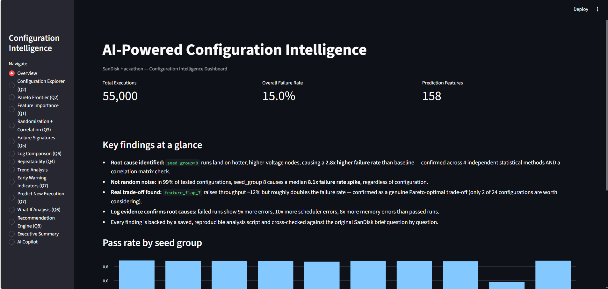
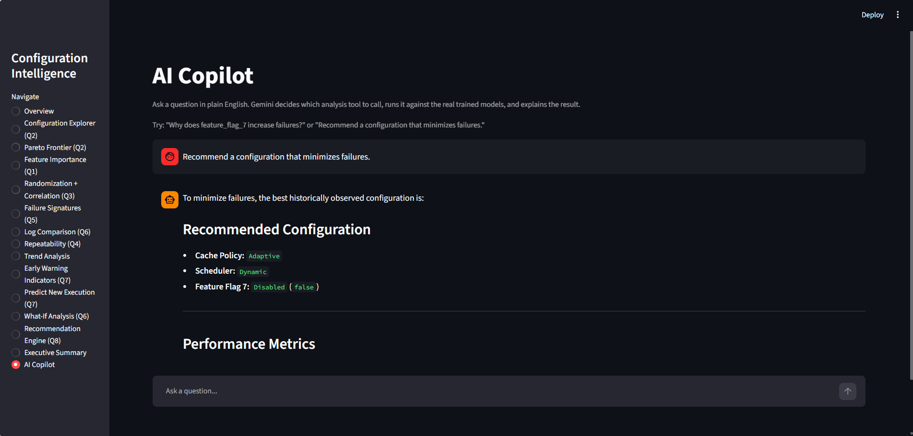
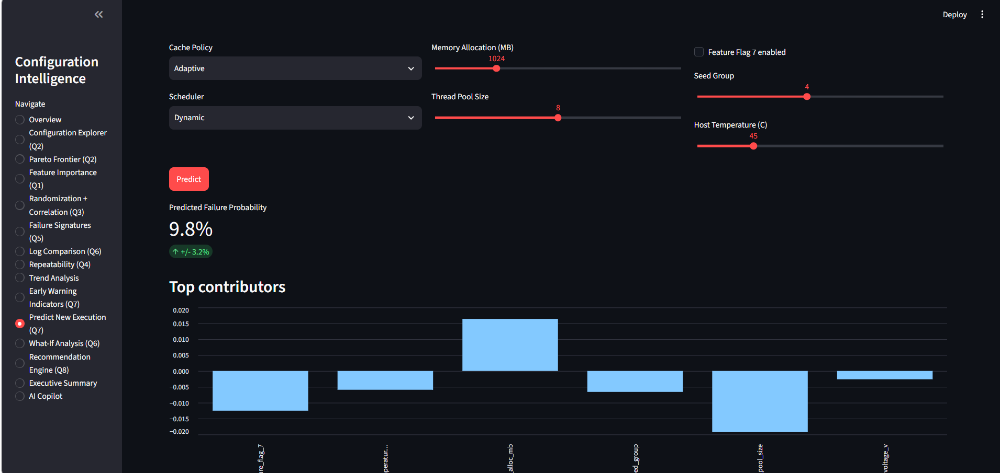
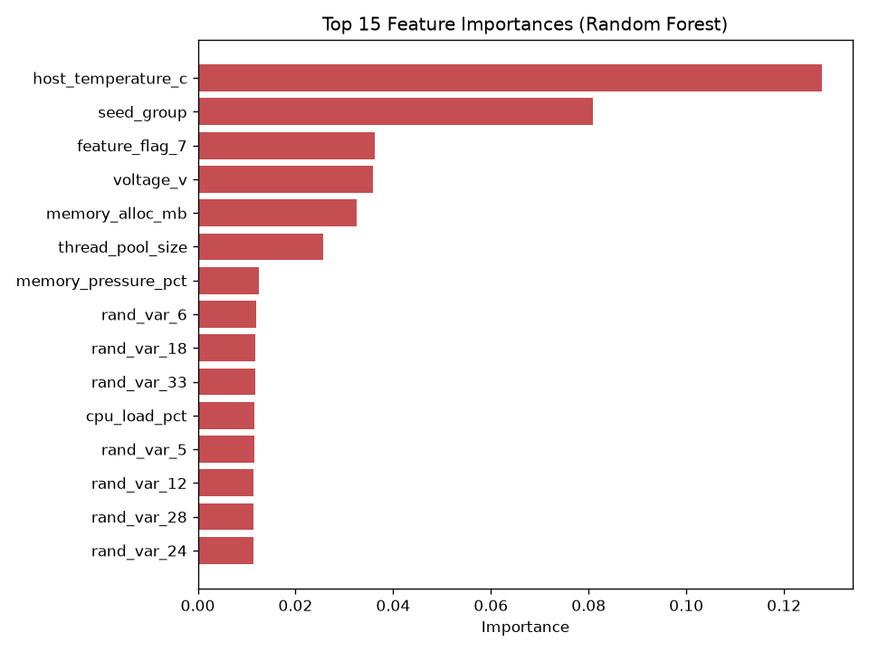
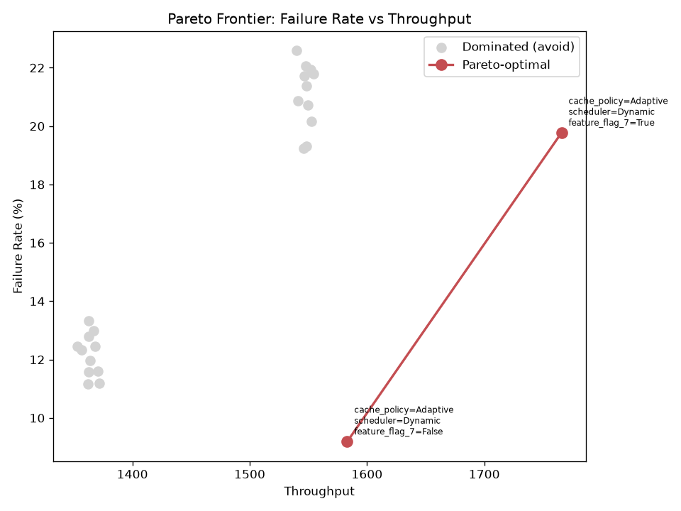
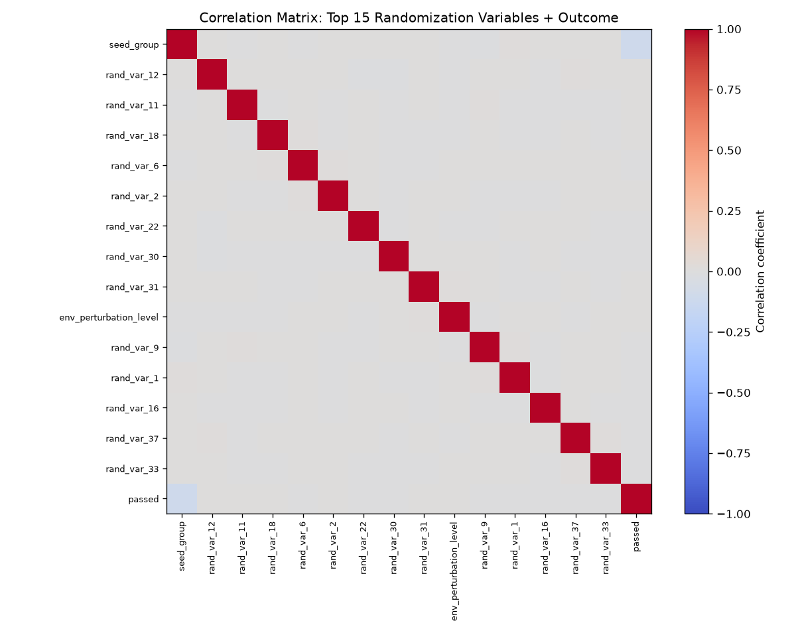
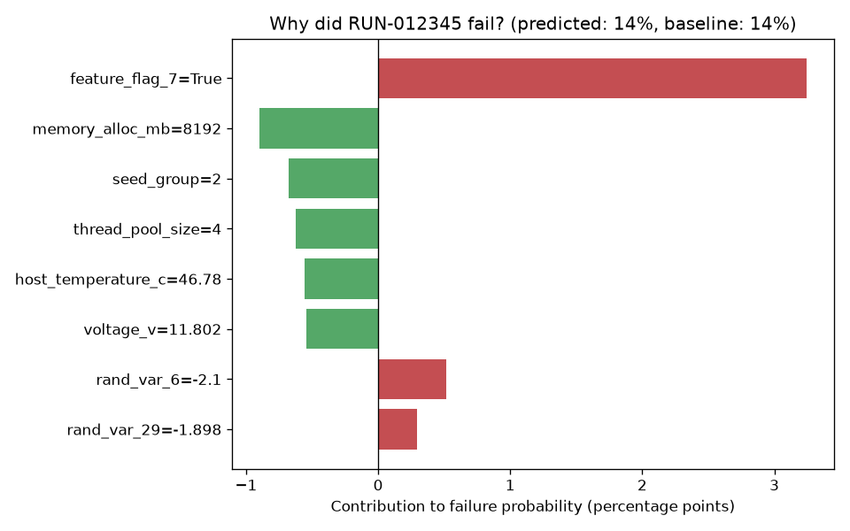

# AI-Powered Configuration Intelligence

**An end-to-end system that finds, explains, and predicts why software/hardware validation runs fail — built on 55,000 execution logs, 172 configuration/randomization/environment variables, and a real LLM copilot with live tool-calling.**

Originally built for a SanDisk-sponsored hackathon (*Configuration Discovery, Randomization Analysis, Root Cause Intelligence, Predictive Intelligence* — see [Problem Statement](#problem-statement)); developed further as a standalone portfolio project.

---

## What it does

Given raw execution logs from a highly configurable, randomized test system, this project answers eight concrete engineering questions — not with dashboards full of charts nobody reads, but with specific, quantified, statistically-validated findings:

> **"Random Seed Group 8 causes a median 8.1x failure rate spike — traced back to measurably hotter, higher-voltage nodes. This isn't random noise; it's a hardware root cause hiding behind what looked like randomization."**

> **"Enabling `feature_flag_7` increases throughput ~12% but roughly doubles the failure rate. Only 2 of 24 tested configurations are actually worth considering — every other combination is strictly dominated on both metrics simultaneously."**

Every claim above is backed by a specific script, a specific statistical test, and a specific saved output file in this repo — not hand-waving.

---

## Screenshots

| Overview | AI Copilot |
|---|---|
|  |  |

| Predict New Execution |
|---|
|  |

### Real results (generated by this project's own scripts)

| Feature Importance (Q1) | Pareto-Optimal Configurations (Q2) |
|---|---|
|  |  |

| Randomization Correlation Matrix (Q3) | Local Failure Explanation, SHAP (Q5) |
|---|---|
|  |  |

---

## Key features

- **Full analytics pipeline** — data dictionary generation, cleaning, EDA, configuration ranking, randomization impact testing (chi-square, mutual information, model + permutation importance), feature importance with SHAP, failure clustering with dataset-validated "fingerprints," repeatability scoring, Pareto frontier analysis, and more — 20+ scripts, each independently runnable and independently verified
- **Real AI Copilot** — not a keyword-matching chatbot. Uses Gemini's function-calling to read a natural-language question, decide which of 5 analysis tools to call, run it against the actual trained models, and explain the real result. Every number it says traces back to a script in this repo.
- **Explainable by design** — every prediction ships with a SHAP-based breakdown of *why*, a confidence interval (not a vague "trust me"), and an out-of-distribution check that flags when a request is asking the model to extrapolate beyond what it was trained on
- **Interactive dashboard** — 15-page Streamlit app covering every question below, plus live "what-if" comparisons and a multi-objective recommendation engine
- **Honest about its own limits** — the repo includes a dedicated generalization test that deliberately probes the model's blind spots (see [Known Limitations](#known-limitations))

---

## The 8 questions this project answers

| # | Question | How it's answered |
|---|---|---|
| Q1 | What configuration settings most influence success/failure? | Random Forest + SHAP feature importance (`config_intelligence.py`) |
| Q2 | Which configuration combinations yield the best results? | Ranked Configuration Explorer + Pareto frontier (`config_explorer.py`, `pareto_frontier.py`) |
| Q3 | Which randomization parameters have the highest impact? | Chi-square, mutual information, model + permutation importance, correlation matrix (`randomization_intelligence.py`, `correlation_matrix.py`) |
| Q4 | Are failures deterministic or random? | Repeatability scoring with seed-level breakdown (`deterministic_vs_random.py`) |
| Q5 | What factors contributed to failures? | Failure clustering with dataset-validated fingerprints + log-evidence signatures (`failure_clustering.py`, `failure_signatures.py`) |
| Q6 | What changed between pass/fail runs? | Log comparison + AI-copilot config diff tool (`failure_signatures.py`, `ai_copilot.py`) |
| Q7 | Can future failures be predicted? | Random Forest classifier with tree-vote confidence + OOD safety check (`predict_new_execution.py`) |
| Q8 | What configuration should be used next? | Multi-objective recommendation engine with Wilson-score confidence intervals (`recommendation_engine.py`) |

---

## Architecture

```
                         RAW EXECUTION LOGS
                        (55,000 runs x 172 cols)
                                 |
                                 v
                  ┌──────────────────────────┐
                  │   Data Processing Layer   │
                  │  dictionary → clean →     │
                  │  feature/target/log split │
                  └──────────────────────────┘
                                 |
                                 v
                  ┌──────────────────────────┐
                  │      Analytics Layer      │
                  │  EDA, correlation, trend, │
                  │  clustering, statistics   │
                  └──────────────────────────┘
                                 |
                                 v
                  ┌──────────────────────────┐
                  │       AI/ML Layer         │
                  │  Random Forest (fail +    │
                  │  throughput), SHAP,       │
                  │  Wilson CI, OOD checks    │
                  └──────────────────────────┘
                                 |
                  ┌──────────────┴──────────────┐
                  v                              v
      ┌────────────────────┐         ┌───────────────────────┐
      │   Streamlit          │         │    AI Copilot          │
      │   Dashboard           │         │    (Gemini function    │
      │   (15 pages)          │         │    calling, 5 tools)   │
      └────────────────────┘         └───────────────────────┘
```

---

## Tech stack

`Python` · `pandas` / `numpy` · `scikit-learn` · `SHAP` · `Streamlit` · `Gemini API` (function calling) · `matplotlib` · `scipy`

---

## Project structure

```
backend/             All analysis scripts (run order in Setup below) + models/ (trained artifacts, gitignored)
frontend/             dashboard.py -- the Streamlit app
data/raw/             Generated dataset (gitignored, regenerate with generate_data.py)
data/processed/       Cleaned features/target/outcomes (gitignored, regenerate with preprocessing.py)
outputs/              Every chart (.png) and results table (.csv) -- committed, browsable without running anything
docs/screenshots/     Dashboard UI screenshots for this README
```

---

## Setup

```bash
git clone <this-repo-url>
cd <repo-folder>
python -m venv .venv
.venv\Scripts\Activate.ps1        # Windows
# source .venv/bin/activate       # macOS/Linux
pip install -r requirements.txt
```

**Get a free Gemini API key** at [aistudio.google.com](https://aistudio.google.com) (needed for the AI Copilot and executive summary generator).

```bash
cp .env.example .env
# then edit .env and set GEMINI_API_KEY=your-actual-key
```

---

## Running it

All commands run from inside `backend/`:

```bash
cd backend

python generate_data.py                        # creates the dataset
python data_dictionary.py ../data/raw/execution_logs.csv
python preprocessing.py
python eda.py
python config_explorer.py
python randomization_intelligence.py
python config_intelligence.py                   # trains the main model
python failure_explainer.py
python failure_clustering.py
python deterministic_vs_random.py
python predict_new_execution.py
python recommendation_engine.py
python pareto_frontier.py
python what_if_analysis.py                      # trains the throughput model
python failure_signatures.py
python correlation_matrix.py
python trend_analysis.py
python early_warning_indicators.py
python genai_executive_summary.py               # needs GEMINI_API_KEY
python ai_copilot.py                            # interactive chat, needs GEMINI_API_KEY
```

Then the dashboard:

```bash
cd frontend
streamlit run dashboard.py
```

Opens at `http://localhost:8501`.

---

## Known limitations

Honesty about limitations is part of the engineering, not an afterthought:

- **Synthetic data.** The dataset is generated (`generate_data.py`) with deliberately planted, realistic patterns rather than pulled from live SanDisk systems. Every method used here (statistical tests, SHAP, clustering) would apply identically to real data — the pipeline was built to be data-source-agnostic.
- **Failure prediction recall is moderate, not high** (~40-45% recall on the FAIL class at a tuned threshold). This is stated plainly in the model's own output rather than hidden — a good next step for real deployment would be exploring gradient boosting or a cost-sensitive threshold tuned to a specific business cost of false negatives.
- **The model cannot extrapolate.** `test_generalization.py` deliberately demonstrates this: a memory allocation value 4x beyond anything in training produces an *identical* prediction to a normal, in-range value — with no warning from the confidence interval alone. This is why a separate, explicit out-of-distribution check exists and is wired into every prediction path.
- **The AI Copilot's "confidence score"** for the recommendation engine is a real 95% Wilson score interval on the observed failure rate — a rigorous, standard statistical method — but it does not account for whether the *model* extrapolated to reach that number; the OOD check is a separate, complementary safeguard.

---

## Future work

- Deploy live (Streamlit Community Cloud)
- Swap in real execution logs when available
- Try gradient boosting (XGBoost) as a comparison model
- Formal anomaly detection and causal inference methods (currently narrative/correlational)

---

## Problem Statement

<details>
<summary>Original hackathon brief (click to expand)</summary>

Build an AI-driven dashboard that ingests execution logs, telemetry data, configuration metadata, and test results to identify: which configurations are most successful, which randomized parameters correlate with failures, what settings maximize performance, what combinations lead to instability, which environmental factors matter most, and what should be recommended for future runs — in a highly configurable, randomized environment where patterns are not obvious.

</details>

---

## License

MIT — see [LICENSE](LICENSE)